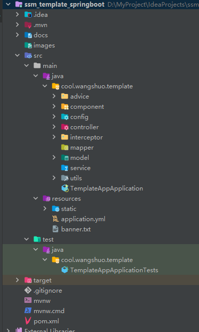
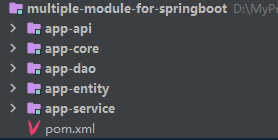

该项目是本人在实际的项目开发过程中，对项目中一些好用的特性抽取出来，组成了这个项目 - 基于 **SSM** （一般是指 springbooot + springmvc + mybatis ）一套模板

本项目提供了一些常见的类，和一些常见的前后端交互示例

包含下面的部分

- 数据库框架: mp (mybatis-plus)
- 前端数据校验:  Validation
- 后端接口权限校验：自定义注解 + 拦截器
- 后端接口文档生成工具: knife4j
- 后端邮件发送: spring-boot-mail-start
- 后端缓存: spring-boot-starter-data-redis
- excel 表格（生成）导出功能
- 通用的 CRUD 模块
- 通用的用户模块。包括：登录、注册、获取用户信息、登出、等等功能
- 模拟数据生成
- 等等


## 目录/包 结构介绍



项目基于 **Maven** 构建，采用 Java 后端开发常用的三层架构(controller、service、dao)，分别对应的包 

- **cool.wangshuo.st.controller** 
- **cool.wangshuo.st.service**
- **cool.wangshuo.st.mappper**

> 值得在真实的项目开发中，可能是如下图所示的目录结构，本项目就不弄这么复杂了，这里只是提一句




- advice 面向切面编程 校验前端参数
- component 项目中的组件，这里存放过滤器、拦截器等等
- config 保存项目中的配置，包括 Redis 配置、MVC 配置、Knife4 配置、mp 配置等等
- controller 调用下层方法来处理 http 请求
- mapper 基于 mp 完成各种数据库操作
- model 主要指项目中涉及的三种实体类
  - model.request :前端提交的实体类，
  - model.response : 后端响应给前端的实体类
  - model.entity: 后端数据库表对应的实体类
- service 处理业务逻辑类
- utils: 定义项目中使用到的工具类

> 在每一种实体类的包下，一般还会有一个 base 包，存放相关的实体类的基类。下面会简单介绍几种实体类常用的基类。
>

## 项目相关实体命名规范

- 项目类名、属性名、前端请求实体属性等等按照 **驼峰式** 命名
- 数据库字段名按照 **下划线** 命名法

## 实体类

### 数据库相关

实体类在 **cool.wangshuo.st.model.entity** 包下，接口方法在 **cool.wangshuo.st.mapper** 包下

值得注意的是:

这里为数据库实体类定义了一个基类，即 **BaseEntity**，抽取公共属性到这个类中，所有的数据库实体类都继承与这个类，在这个类上进行扩展。

属性方面:

常用的属性有 **id** (主键id)、createTime（列创建时间）、updateTime（更新时间) 等等

 字段的更新是通过自定义的 **MetaHandler**  类，来实现的，如果你要更新这个类的属性列表，请不要忘记更新这个类相关的内容。下面是一个参考的示例:

```java
import com.baomidou.mybatisplus.core.handlers.MetaObjectHandler;
import org.apache.ibatis.reflection.MetaObject;
import org.springframework.stereotype.Component;

@Component
public class MetaHandler implements MetaObjectHandler {

    /**
     * 新增数据执行
     */
    @Override
    public void insertFill(MetaObject metaObject) {
        boolean hasSetter = metaObject.hasSetter("createTime");
        if (hasSetter) {
            this.setFieldValByName("createTime", new Date(), metaObject);
            this.setFieldValByName("updateTime", new Date(), metaObject);
        }
    }

    /**
     * 更新数据执行
     */
    @Override
    public void updateFill(MetaObject metaObject) {
        Object val = getFieldValByName("updateTime", metaObject);
        if (val == null) {
            this.setFieldValByName("updateTime", new Date(), metaObject);
        }
    }

}
```

> 本项目简单实例只定义了 *id* ，和 **createTime** 两个字段，可根据需求酌情添加

### 前端请求实体类相关

基类


### 响应实体类相关

基类

## 组件类

包可以存放拦截器，过滤器，

这里介绍几种常用的组件

日志打印拦截器，用于打印 http 请求的日志信息:

```java
@Component
@Slf4j
public class LogInterceptor implements HandlerInterceptor {


    public LogInterceptor() {

    }

    @Override
    public boolean preHandle(HttpServletRequest request, HttpServletResponse response, Object handler) throws Exception {

        // 拦截后端接口
        if (handler instanceof HandlerMethod) {
            Method method = ((HandlerMethod) handler).getMethod();
            // 获取注解，用于判断注解是否存在
            ApiOperation api = method.getAnnotation(ApiOperation.class);
            log.info("\033[1;94m{} {} {} \033[m",request.getRemoteAddr(), request.getRequestURI() != null ? request.getRequestURI() : "", api!=null && api.value() != null ? api.value() : "");
        }
        return true;
    }

    @Override
    public void postHandle(HttpServletRequest request, HttpServletResponse response, Object handler, ModelAndView modelAndView) throws Exception {
        HandlerInterceptor.super.postHandle(request, response, handler, modelAndView);
    }

    @Override
    public void afterCompletion(HttpServletRequest request, HttpServletResponse response, Object handler, Exception ex) throws Exception {
        HandlerInterceptor.super.afterCompletion(request, response, handler, ex);
    }
}
```

等等

## 配置类

包括以下配置类

- Redis :配置类 LettuceRedisConfig
- SpringMVC 配置类 :MyMvcConfig
- Mybatis-plus 配置类 MybatisPlusConfig
- Swagger2（knife4）:配置类 Knife4Config
- 等等

### 跨域配置

类位置: MyMvcConfig

```java
/**
 * 跨域相关配置
 * @param registry
 */
@Override
public void addCorsMappings(CorsRegistry registry) {
    registry.addMapping("/**")
        //是否发送Cookie
        .allowCredentials(true)
        //放行哪些原始域
        .allowedOriginPatterns("*")
        .allowedMethods(new String[]{"GET", "POST", "PUT", "DELETE"})
        .allowedHeaders("*")
        .exposedHeaders("*");
}
```


### 日期格式化配置

位置: DateFormatForJson#extendMessageConverters

```java
/**
 * @author rosercode
 * @date 2023/4/19 19:29
 */

@Configuration
public class DateFormatForJson implements WebMvcConfigurer {

    @Value("${spring.jackson.date-format}")
    private String dateFormat;


    @Override
    public void extendMessageConverters(List<HttpMessageConverter<?>> converters) {
        MappingJackson2HttpMessageConverter converter = new MappingJackson2HttpMessageConverter();
        ObjectMapper objectMapper = converter.getObjectMapper();
        // 生成JSON时,将所有Long转换成String
        SimpleModule simpleModule = new SimpleModule();
        simpleModule.addSerializer(Long.class, ToStringSerializer.instance);
        simpleModule.addSerializer(Long.TYPE, ToStringSerializer.instance);
        objectMapper.registerModule(simpleModule);
        // 时间格式化
        objectMapper.configure(DeserializationFeature.FAIL_ON_UNKNOWN_PROPERTIES, false);
        objectMapper.setDateFormat(new SimpleDateFormat(dateFormat));
        // 设置格式化内容
        converter.setObjectMapper(objectMapper);
        converters.add(0, converter);
    }

}
```

yml 配置

```yaml
spring:
  jackson:
    time-zone: GMT+8
    date-format: yyyy-MM-dd HH:mm:ss
    default-property-inclusion: non_empty
```

### 在线接口文档配置

位置: Knife4Config

项目使用的 `knife4`

```java
@EnableKnife4j
@Configuration
@EnableWebMvc
@EnableSwagger2WebMvc
public class Knife4Config {

    @Bean
    public Docket createRestApi() {
        return new Docket(DocumentationType.SWAGGER_2)
                .apiInfo(apiInfo())
                //是否开启 (true 开启,false隐藏。生产环境建议隐藏)
                .enable(true)
                .select()
                // 扫描的路径包,设置basePackage会将包下的所有被@Api标记类的所有方法作为api
                .apis(RequestHandlerSelectors.basePackage("cool.wangshuo.st.controller"))
                //指定路径处理PathSelectors.any()代表所有的路径
                .paths(PathSelectors.any())
                .build();
    }

    private ApiInfo apiInfo() {
        return new ApiInfoBuilder()
                .title("Album 系统接口文档") //设置文档标题(API名称)
                .description("文档描述") //文档描述
                //.termsOfServiceUrl("http://localhost:5446/") //服务条款URL
                .version("1.0.0") //版本号
                .build();
    }
}
```

### mp 分页配置

​	

## 工具类

## 参数校验

`springboot` 项目一般使用 `Validator框架`

```xml
<!--springboot 请求参数校验-->
<dependency>
    <groupId>org.springframework.boot</groupId>
    <artifactId>spring-boot-starter-validation</artifactId>
</dependency>
```

https://juejin.cn/post/7109131754182541348#heading-1

### 引入依赖

## 权限校验

### 